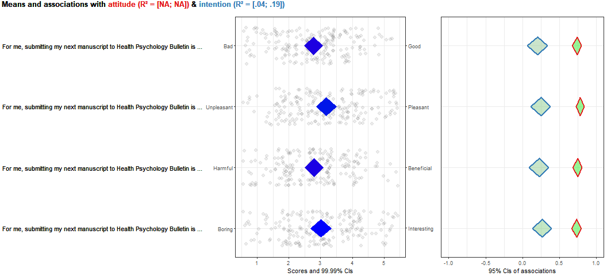
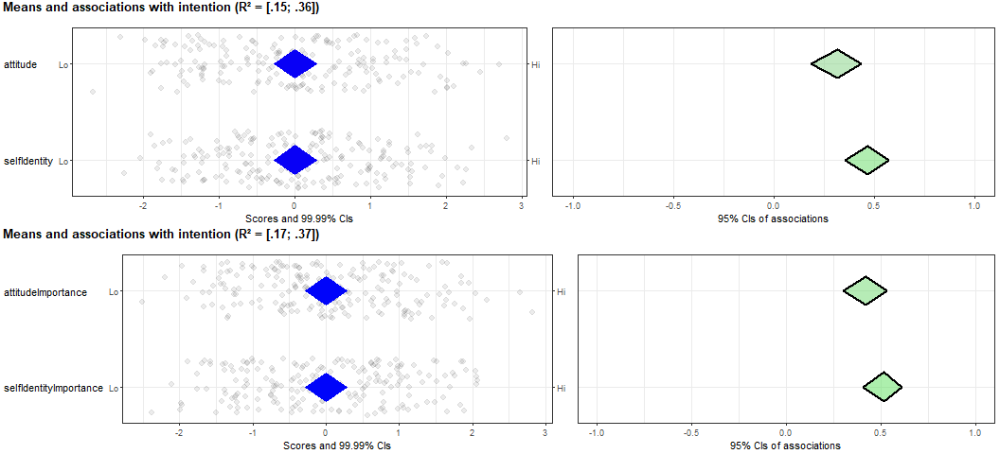

<!--   This is the R Markdown file for the article "Establishing     -->
<!--   determinant importance using CIBER: an introduction and       -->
<!--   tutorial" by Crutzen and Peters, 2018. Scroll down for the    -->
<!--   article text, and further down for the analyses.              -->
Manuscript text
===============

When developing behavior change interventions, it is important to target the most important determinants of behavior (i.e. psychological constructs that predict behavior). This is challenging for two reasons. First, determinant selection requires integrating multiple information sources: determinants' associations with either behavior or with determinant that mediate their effect on behavior (i.e. effect sizes), as well as how much room for improvement there is in the population (i.e. means and spread). Second, only information from samples is normally available, and point estimates obtained from samples vary from sample to sample, and therefore cannot be interpreted without information about how much they can be expected to vary over samples. In practice, determinant studies often present multivariate regression analyses, but this is problematic because by default, shared covariance is removed from the equation (literally), compromising operationalisations' validity and affecting effect sizes (i.e., the results of such analyses cannot be used as a first source of information regarding each determinant's association to behavior).

In the present contribution, we will briefly explain these points in more detail, after which we will introduce a solution: confidence interval based estimation of relevance (CIBER). We will then present a brief tutorial as to how to generate CIBER plots and how to interpret them. This is a more detailed explanation and introduction: originally, CIBER was published in Crutzen, Peters & Noijen (2017).

Why determinant importance is important
---------------------------------------

Public health interventions have to potential to be cost-effective means to improve health and well-being (Masters, Anwar, Collins, Cookson & Capewell, 2017). They often do this by targeting human behavior. All overt human behavior is controlled from neurons in the motor cortex, activation of which occurs through activation of other networks of neurons (for more background, see Peters & Crutzen, 2017, and Crutzen & Peters, 2018). The networks of neurons that form a human brain can be considered the neural substrate of the entirety of human psychology. Therefore, while on a neuronal level, any successful behavior change intervention necessarily achieves this success by changing neural networks that ultimately activate motor cortex neurons, on a psychological level, any successful behavior change intervention can be said to necessarily achieve this success by changing aspects of the human psychology that are important for the target behavior.

Successfully changing aspects of human psychology requires learning in the target individuals (Crutzen & Peters, 2018). Humans have evolved several learning processes which, if properly leveraged, may realise this learning. These evolutionary learning principles correspond to different types of memory, and therefore, different evolutionary learning principles may be used to target different types of aspects of the human psychology (e.g. based on emotional memory, procedural memory, or declarative memory; see e.g. Aunger & Curtis, 2015). These evolutionary learning principles operate at a very fundamental level of human psychology, but psychologists studying behavior change have usually studied behavior change principles on higher levels of abstraction. For example, behavior change principles such as goal setting or planning coping responses represent packages of instructions that, when implemented properly, reliably engage one or more evolutionary learning processes. Two prominent lists of behavior change principles are the behavior change technique (BCT) taxonomy (Abraham & Michie, 2008) and the taxonomy of methods of behavior change (Kok et al., 2016), based on the Intervention Mapping framework for intervention development (Bartholomew, Parcel & Kok, 1998; Cullen, Bartholomew, Parcel & Kok, 1998; Bartholomew Eldredge, Markham, Ruiter, Fernàndez, Kok, & Parcel, 2016).

Similarly, psychologists have studied the aspects of human psychology that determine whether an individual performs a behavior on relatively high levels of abstraction. Many theories of behavior change propose constructs that predict behavior called determinants. These determinants, like other psychological constructs, have a definition and instructions for operationalisation. Psychological constructs can be operationalised in two ways: they can be measured and they can be manipulated. If a psychological construct is a determinant, its operationalisation into a manipulation is by definition a behavior change principle: to the degree that the determinant is important for the target behavior, changing the determinant also changes that target behavior.

Given the richness of human psychology, it is no surprise that there exist no 'magic bullet' behavior change principles that can always be relied on. Instead, which behavior change principles are most likely to be effective depends on which types of memories must be targeted (Crutzen & Peters, 2018). This link manifests as a pairing of determinants and behavior change principles, such that the likelihood of engaging the underlying evolutionary learning principles is optimal. Note that this is also true for efforts to change behavior that are based on an ecological approach. Aspects of individuals' environments (contextual factors, environmental conditions, et cetera) cannot have any influence on the behavior of those individuals without changing aspects of their psychology. An individual's behavior, after all, is exclusively controlled by activation patterns in their motor cortex; and those activation patterns cannot be changed directly, but only through changes in other aspects of the individual's psychology (Crutzen & Peters, 2018).

As a consequence, a crucial step in the development of behavior change interventions is the selection of the most important determinants. Colloquially, these determinants can be seen as the buttons one needs to push to establish behavior change.

When a determinant is important
-------------------------------

Determinant importance depends on two things. The first is the determinant's association to behavior, or, as is often the case, to a theoretical mediator of the determinant's effect on behavior. For example, when an interventon developer develops an intervention for a reasoned behavior, a suitable theory may be the Reaoned Action Approach (RAA; Fishbein & Ajzen, 2010). This theory holds that behavior is predicted by a determinant called intention (i.e. a person's intention to engage in the behavior), which in turn is predicted by three other determinants: attitude (a person's evaluation of the behavior's consequences), perceived norms (a person's perception of the approval and behavior of relevant social referents), and perceived behavioral control (a person's perception of their ability and control over the behavior). If a determinant study is conducted and the correlation of attitude to intention and behavior is zero, it seems unlikely that changes in attitude will result in behavior change. However, even if a determinant is strongly associated to behavior or a theoretical mediator, it may still not be a relevant intervention target.

This is because of the second thing that determinant importance depends on: the distribution of the determinants' scores in the population (as estimated by inspecting the distribution of sample scores). A determinant that is strongly associated to behavior may still be a bad choice as intervention target if its distribution is very skewed. For example, most ecstasy users are aware that using a high dose of ecstasy is bad for their health. Even if this variable is strongly associated to their behavior, this association is caused by only a few people who deny these health effects. When developing an intervention, investing resources in targeting this small group will yield less total effects on behavior than when targeting a determinant with a weaker association but with more room for improvement.

Note that this reasoning does not only hold when selecting determinants (such as attitude), but also when selecting subdeterminants. Subdeterminants are here defined as determinants at a lower level of psychological generality that are theoretically assumed to predict or be a part of overarching determinants. This definition means that whether a determinant is called a 'determinant' or a 'subdeterminant' is somewhat arbitrary. For example, within the RAA, attitudinal beliefs such as expectancies or risk perceptions can be called subdeterminants, because they are theoretically assumed to predict, or be a part of, their 'overarching' determinant attitude. At the same time, attitude, perceived norms, and perceived behavioral control can be called subdeterminants because they are theoretically assumed to predict, or be a part of, their 'overarching' determinant intention (note that perceived behavioral control is also assumed to influence behavior directly, so the case could be made that labeling it a subdeterminant would be inaccurate).

So, to summarize, successful behavior change requires successful change of one or more aspects of human psychology. These aspects are defined in, and can be operationalised using, psychological theory, and are called (sub-)determinants. Once operationalised, their importance can be established to identify the best intervention targets. Establishing this (sub-)determinant importance requires simultaneous inspection of the determinant's association to theoretical mediators of its effects on behavior, potentially to behavior directly, and of the determinant's distribution. Most researchers do this by computing point estimates (e.g., correlation coefficients), but unfortunately, these are virtually uninformative on their own.

Why point estimates cannot be used to estimate determinant importance
---------------------------------------------------------------------

When inspecting association and distribution estimates, the population values are always unknown. The only way to learn about a population is by taking a random sample and inspecting that sample. This instrument, however, is somewhat of a mixed blessing. On the one hand, sampling provides the researcher with a way to 'look at' the population. On the other hand, sampling, by its random nature, necessarily introduces random variation. This means that whatever is observed in the sample may not reflect the population.

This creates the somewhat frustrating situation that the only means available to observe a population also inevitably distort that observation. Any value computed from a sample will have a different value if the sampling is repeated. Therefore, the specific estimate arrived at on the basis of any particular sample has next to no value. It is also necessary to know how accurate the estimate is: how much it can be expected to differ between samples. Fortunately, there is a way to estimate this.

This estimation of accuracy is based on the concept of the sampling distribution: the theoretical distribution containing all potential values for any sample estimate, given its (unknown) population value and the sample size. Because the population value is always unknown (otherwise one wouldn't have to sample in the first place), the true sampling distribution is necessarily also known. However, for many parameters that can be estimated from a sample, the shape and spread of the sampling distribution *are* known. This means that the sampling distribution can be constructed for any hypothetical population value.

The best known example is perhaps the sampling distribution of the mean, which is approximately normally distributed (except for extremely small samples) with a standard deviation equal to the population standard deviation divided by the square root of the sample size. Knowing the sampling distribution's distribution shape and spread allow computation of intervals that contain, in infinite repetitions of the sampling procedure, the population value in a given percentage of the samples: the confidence interval. A wide confidence interval means that the point estimate is very unreliable and can have a substantially different value in a new sample, whereas a tight confidence interval means that a substantially different value in a new sample is less likely. These properties, in combination with the fact that health psychologists are generally familiar with confidence intervals, make them well suited for estimation of population values from sample data.

Therefore, whenever using sample data to draw conclusions for intervention development (or anything, really), point estimates should not be used. Instead, also considering estimate accuracy, for example by computing confidence intervals, allows taking the inevitable sampling and error variation into account. However, this also means that inspecting determinant importance becomes almost an inhuman task: one has to simultaneously compare three times as much information (e.g., means *and* correlations coefficients, as well as the confidence intervals regarding *both* point estimates). Visualisation can help, and this is what confidence interval based estimation of relevance (CIBER) is based on. CIBER plots simultaneously visualise (sub-)determinant distributions, confidence intervals for the mean, and confidence intervals for bivariate correlations to one or more theoretical mediators and/or behavior. Before explaining how to order and read a CIBER plot, we will explain why CIBER plots use correlations instead of regression coefficients.

Why regression coefficients cannot be used to estimate determinant importance
-----------------------------------------------------------------------------

Determinant studies often contain regression analyses where a theoretical mediator of determinants' effects on behavior (e.g., intention) or behavior itself, is regressed on the measured determinants (or subdeterminants). Such regression analyses are useful, because they yield a multiple correlation coefficient: the correlation of the criterion (dependent variable) with the best prediction of the criterion as computed from the predictors in the model. Squaring this multiple correlation coefficient yields *R2*, the proportion of the variance in the criterion that can be explained by the predictors in this sample. Because the distribution of *R2* is known, a confidence interval can be constructed, allowing tentative conclusions as to likely population *R2* values, which is indicative of the maximum effect that can be expected of an intervention that successfully changes all determinants in the model.

A convenient feature of regression analysis is that overlap between predictors in their explanation of the criterion is removed from the equation (quite literally, in the case of regression). Squaring a correlation coefficient always yields the proportion of explained variance: if attitude and intention have a bivariate (i.e. zero-order) correlation of *r* = .32, that means that they each explain .1 (i.e., .32 x .32) of each other's variance in the sample. The 95% confidence interval runs from \[0.03; 0.19\], which gives some idea of how far the explained variance in the population can be expected to deviate from that sample estimate. Another determinant, self-identity, has a correlation of *r*=.47 with intention, and so this determinant explains .22 of intention.

However, attitude and self-identity correlate with each other (*r* = .32). It is therefore likely that they also share explained variance in intention. In that case, simply adding together the proportion of intention's variance they each explain (.1 + .22 = .32) would yield an overestimate of how much intention these determinants explain together (which is in fact .25 in this sample, with a 95% confidence interval of \[0.15; 0.36\]).

This correction of overlap in explained variance is very useful, and enables better estimation of the variance explained by all predictors together. However, this overlap between predictors is in itself highly problematic when dealing with the separate regression coefficients of all psychological constructs used as predictors (Azen & Budescu, 2003; Budescu, 1993; Elwert & Winship, 2014). This problem is in part the consequence of potential overlap in the operationalisations of these psychological constructs.

Assuming the applications of the used operationalisations in the relevant sample have high validity (after all, if they have low validity, it makes no sense to analyse the resulting data), correlation between the corresponding data series represents relevant information about human psychology. For example, the two constructs may cover the same aspects of human psychology according to their definition. In that case their operationalisations will also measure the same aspects of human psychology, and therefore, the data series generated by these operationalisations will correlate. Or alternatively, the constructs may be independent but causally related, either because they influence each other (directly or through one or more mediators) or are both influenced by the same third variable. As we argued before, it is hard to empirically distinguish between constructs that influence or consist of each other (Peters & Crutzen, 2017), and the distinction is irrelevant with respect to the problem that surfaces in multivariate analyses.

In this case, removing the variance representing this overlap from the data series corresponding to a construct's operationalisation means removing variance that corresponds to aspects of human psychology that fall within the definition of the construct. In other words, removing this shared variance from a determinant and only considering variance that is not shared with other determinants means that the resulting data series no longer represents the determinant as originally operationalised, and therefore, as defined, but an unknown alteration of this determinant.

This is a necessary consequence of observational research: if two dataseries share explained variance in a third dataseries, it is impossible to know to which dataseries the shared explained variance 'belongs'. In fact, it is likely it belongs to both: if the correlation between the dataseries is indicative of overlap in the definitions of the two constructs that correspond to the data series, these two constructs explain the same aspects of the criterion. Therefore, removing this shared explained variance when estimating the regression coefficients means that these regression coefficients no longer represent the association of each predictor to the criterion. Instead, they represent the association of some unknown part of each predictor with some unknown part of the criterion.

Another way to think about this is by using the formulation often invoked when explaining regression analyses: the regression coefficient expresses the association of a predictor to the criterion *holding all other predictors constant*. If two predictors overlap in their definition, or, in other words, if the definitions of the constructs represented by the two predictors contain the same aspects of human psychology, then 'holding all other predictors constant' means 'neglecting a part of human psychology'. This means the resulting situation is unrealistic and can never occur. Given that the operationalisations of both constructs was valid, this also means that the omitted aspects of human psychology are in fact important to predicting the relevant behavior. Therefore, a predictor that represents an important determinant of behavior may nonetheless have a small regression coefficient, because an important part of the human psychology as defined in the constructs definition was omitted from the coefficient.

Because this can be hard to grasp, we include an example. Imagine we do a small-scale determinant study. We measure two determinants of intention: attitude and self-identity. Self-identity is one of the variables explicitly covered by Fishbein and Ajzen (2010) in their discussion of potential fourth variables that could be added to the Theory of Planned Behavior (or, by implication, its successor, the Reasoned Action Approach). They argued that the concept was ill-defined, and that common operationalisations actually covered the perceived 'importance' of a behavior. They argued that this can be considered part of the attitude construct, and therefore, including 'importance scale' in attitude's measurement would eliminate any additional explained variance by self-identity: "\[...\] if importance scales were included in the semantic differential measure of attitude, obtaining a separate measure of self-identity by means of importance items would be of little value." (Fishbein & Ajzen, p. 292). Given that importance can clearly be considered both a part of attitude and self-identity, this lends it well to an illustration of our point.

In this hypothetical determinant study, therefore, we include the importance scale in addition to the determinants (attitude and self-identity) and the criterion (intention). We have included the items used in this hypothetical study in the R Markdown file in the supplementary materials (see the Open Science Framework at <https://osf.io/hg4ks/>). The correlations used in the earlier illustrations were in fact derived from the dataset we simulated for this hypothetical determinant study. Figure 1 shows two Venn Euler diagrams that use the `eulerr` package (Larsson, 2018) to show the proportional areas of overlap in explained variance between the three variables in this determinant study.

The left diagram shows the situation where attitude and self-identity are operationalised without including the importance scale. Therefore, these variables represent a more limited definition of the attitude and self-identity constructs. In this sample, the correlation coefficients with intention are .32 for attitude and .47 for self-identity, they together explain .25 of the variance in intention, and their regression coefficients are respectively .18 and .41 (all variables are standardized). As the left diagram shows, the squared correlation between attitude and intention is *r*^2 = .03 + .07 = .10, and the squared correlation between self-identify and intention is *r*^2 = .151 + .07 = .221. In this situation, .07 or seven percent of the covariance between the variables is omitted from the equation when the regression coefficients are estimated.

The right diagram shows the situation where the importance scale is included in the operationalisation of both constructs. The definitions of both constructs are therefore more broad than in the left diagram; but note that these broader definitions can be argued to be correct, and can conceivable be used in the same study. In this sample, the correlation coefficients with intention are .42 for attitude and .51 for self-identity, they together explain .27 of the variance in intention, and their regression coefficients are respectively .07 and .46. This diagram shows the large overlap between the variables: .176 of the variance is shared between attitude, self-identity, and intention. This .176 represents almost twenty percent of the variance in intention that cannot be designated to one of the predictors (and therefore, is not reflected in their regression coefficients).

In the left situation, the correlations indicate that both attitude and self-identity seem feasible intervention targets. When removing their overlap, the apparent feasibility of attitude drops a bit, and although this paints a slightly misleading picture by exaggerating the differences in importance between attitude and self-identity, the effect is quite subtle.

However, the right graph paints a different picture. When both predictors represent determinants that are defined, and operationalised, as partly covering the same aspects of human psychology, the difference between correlations and regression coefficients becomes substantial. Whereas the correlation coefficients would again imply that both determinants are feasible intervention targets, based on the regression coefficients, attitude seems irrelevant to predicting intention.

That conclusion, however, would be wrong. It would be valid only if one would redefine attitude such that all overlap with self-identity, in the prediction of intention, is removed from attitude's variance. That would mean the resulting data series (i.e. the residuals) no longer represent the determinant attitude. After all, that construct's definition did include importance.

It is unclear what exactly the two remaining data series do represent. Psychological constructs often covary, and this covariance represents not bias or measurement error, but real aspects of human psychology. Removing such covariance from estimations of a construct's importance means that it is no longer clear what is being inspected.

This becomes problematic when engaging in behavior change. For example, in this case, the intervention developer may mistakenly decide to only try and target self-identity. While for attitude, a wealth of behavior change methods exists (see Kok et al., 2016), for self-identity, no effective methods have been identified in the available lists of behavior change principles, and while some may exist, it seems likely that successfully changing self-identity is much harder than successfully changing attitude.

Thus, because estimates from multivariate analyses are problematic when establishing determinant relevance, it is better to base such decisions on the bivariate correlations, or more accurately, on the confidence intervals for these correlation coefficients, together with the information about the (sub-)determinants' distributions and means. We will now illustrate a method for efficiently inspecting all this information simultaneously: confidence interval based estimation of relevance.

Confidence interval based estimation of relevance
-------------------------------------------------

To illustrate confidence interval based estimation of relevance (CIBER), we will use four subdeterminants of attitude as these allow a more complete demonstration. The resulting CIBER plot is shown in Figure 2 (we refer readers who are interested in the CIBER plots obtained from the determinants' association with intention to the OSF repository of this article at <https://osf.io/hg4ks/>).

A CIBER plot contains a large amount of information. First, the left-hand panel shows the questions used to measure these subdeterminants, the left and right anchors of the answer scales, each participants' score, and a 99.99% confidence interval for the mean. This allows easy spotting of skewed distributions or other deviations from normality which are important to take into account when selecting determinants for intervention (with these simulated data, these distributions are approximately normal; for a real-life example, see Crutzen, Peters & Noijen, 2017).

The right-hand panel shows each subdeterminant's association to both attitude and intention. Each correlation coefficient is represented by a diamond showing the point estimate as well as the lower and upper bounds. Because attitude is the mean of the scors on these four items, the correlations of the subdeterminants with attitude are very high, while the correlations with intention are considerably lower.

Finally, the CIBER plot's title shows the proportions of explained variance. This title simultaneously functions as a legend to identfty which diamonds correspond to which determinant. As can be seen here, the proportion of explained variance of attitude could not be estimated; this makes sense, because it is necessarily 1 (after all, attitude is the mean of the four subdeterminants).

To generate a CIBER plot, a function is available in the free R package `userfriendlyscience` (Peters, 2017). To install the package in R, use the following command;

    install.packages('userfriendlyscience');

This command is necessary only once; once the package has been installed, it will remain available. After having installed the package, it can be loaded in an R session by using the following command:

    require('userfriendlyscience');

This needs to be repeated in every R session (because R has thousands of packages available, these are not all automatically loaded every time; users can indicate which packages they need in a session).

Then, the CIBER plot can be generated using the `CIBER` command. For example, a simple version of the CIBER plot shown in Figure 2 can be obtained with this command:

    CIBER(data=dat,
          determinants=c('attitude_good',
                         'attitude_pleasant',
                         'attitude_beneficial',
                         'attitude_interesting'),
          targets=c('attitude', 'intention'));

In this command, the first argument ('data') specifies the data to use. This is a dataset that can be loaded into R using, for example, the `getData` command:

    dat <- getData();

This will open a popup dialog where a datafile can be selected. The selected datafile is then read into memory and named `dat` (in R, multiple datasets can always be open, and therefore, naming a dataset when loading it is mandatory). The other two arguments, 'determinants', and 'targets' specific the variable names of the determinants (the rows of the CIBER plot) and the the higher level determinants or behavior variables with which to show associations in the right-hand panel. Thus, in the simplest case, it is possible to simply load one's dataset into R using the `getData` command and then use the `CIBER` command to specify which determinants and targets to plot.

It is also possible to customize the plot by specifying, as was done in Figure 2, the questions used for each (sub-)determinant by using the 'subQuestions' argument; the left and right anchors by using the 'leftAnchor' and 'rightAnchor' arguments, and it is also possible to change the colors and set other options. An overview of all available options is available by using the following command, which will load the manual page for the CIBER command:

    ?CIBER

Conclusion
----------

Establishing the relative importance of a set of (sub-)determinants, to then select the best intervention targets and be able to select the most fitting behavior change principles (e.g. methods for behavior change or behavior change techniques), is no straightforward affair. There are a number of potential pitfalls. In this article, we aimed to describe these pitfalls, explain why they are problematic, and we present an easy-to-use solution that is freely available. CIBER plots allow researchers and intervention developers to simultaneously evaluate the large amounts of information that need to be evaluated to select the determinants to target in an intervention to optimize the probability of successful behavior change. We hope this can contribute to more informed determinant selection and ultimately, more effective behavior change interventions.

References
==========

Abraham, C., & Michie, S. (2008). A taxonomy of behavior change techniques used in interventions. Health Psychology, 27(3), 379–87. dio:10.1037/0278-6133.27.3.379

Aunger, R., & Curtis, V. (2015). Gaining control: how human behavior evolved. Oxford: Oxford University Press.

Azen, R., & Budescu, D. V. (2003). The dominance analysis approach for comparing predictors in multiple regression. Psychological Methods, 8, 129–148.

Bartholomew, L. K., Parcel, G. S., & Kok, G. (1998). Intervention Mapping: A process for developing theory- and evidence-based health education programs. Health Education and Behavior, 25(5), 545–563. <doi:10.1177/109019819802500502>

Bartholomew Eldrigde, L. K., Markham, C. M., Ruiter, R. A. C., Fernàndez, M. E., Kok, G., & Parcel, G. S. (2016). Planning health promotion programs: An Intervention Mapping approach. San Francisco: Jossey-Bass.

Budescu, D. V. (1993). Dominance analysis: a new approach to the problem of relative importance of predictors in multiple regression. Psychological Bulletin, 114, 542–551. <doi:10.1037/0033-2909.114.3.542>

Cullen, K. W., Bartholomew, L. K., Parcel, G. S., & Kok, G. (1998). Intervention mapping: use of theory and data in the development of a fruit and vegetable nutrition program for girl scouts. Journal of Nutrition Education, 30(4), 188–195.

Crutzen, R., & Peters, G.-J. Y. (2018). Evolutionary learning processes as the foundation for behaviour change. Health Psychology Review, 12(1), 43–57. <doi:10.1080/17437199.2017.1362569>

Crutzen, R., Peters, G.-J. Y., & Noijen, J. (2017). Using Confidence Interval-Based Estimation of Relevance to select social-cognitive determinants for behaviour change interventions. Frontiers in Public Health. <doi:10.3389/fpubh.2017.00165>

Elwert, F., & Winship, C. (2014). Endogenous Selection Bias: The Problem of Conditioning on a Collider Variable. Annual Review of Sociology, 40(1), 31–53. <doi:10.1146/annurev-soc-071913-043455>

Fishbein, M., & Ajzen, I. (2010). Predicting and Changing Behavior: The Reasoned Action Approach. New York: Taylor & Francis Group.

Larsson, J. (2018). eulerr: Area-Proportional Euler and Venn Diagrams with Ellipses. R package version 4.1.0, <https://cran.r-project.org/package=eulerr>

Kok, G., Gottlieb, N. H., Peters, G. Y., Mullen, P. D., Parcel, G. S., Ruiter, R. A. C., … Bartholomew, L. K. (2016). A taxonomy of behavior change methods: an Intervention Mapping approach. Health Psychology Review, 10(3), 297–312. <doi:10.1080/17437199.2015.1077155>

Masters, R., Anwar, E., Collins, B., Cookson, R., & Capewell, S. (2017). Return on investment of public health interventions: a systematic review. Journal of Epidemiology & Community Health, 71(8), 827–834. <doi:10.1136/jech-2016-208141>

Peters, G.-J. Y. (2017). Diamond Plots: a tutorial to introduce a visualisation tool that facilitates interpretation and comparison of multiple sample estimates while respecting their inaccuracy. Health Psychology Bulletin (under Review). Retrieved from <http://diamondplots.com>

Peters, G.-J. Y., & Crutzen, R. (2017). Pragmatic nihilism: how a Theory of Nothing can help health psychology progress. Health Psychology Review, 11(2). <doi:10.1080/17437199.2017.1284015>

Appendix
========

Background
----------

Note that because this is a living project, you will probably need the most up-to-date version of the `userfriendlyscience` package (*if* that has been submitted to CRAN yet). See <https://userfriendlyscience.com> for instructions as to how to install it (or instructions for how to install it from Github).

### Full Disclosure

The Open Science Framework repository for this article is <https://osf.io/hg4ks/>.

### License of these materials

This file and the other materials in the OSF and GitHub repo's associated with this project are licensed under the Creative Commons attribution share alike license (CC-BY-NC-SA; see <http://creativecommons.org/licenses/by-nc-sa/4.0/>). This means that you are allowed to copy and distribute these files freely, but you’re not allowed to sell them. It also means that if you create derivative works (i.e. if you remix, transform, or build upon the material), you must distribute your contributions under the same license as the original.

Analyses
--------

### Questionnaire

These data were gathered by the following hypothetical questionnaire:

| Variable      | Item                                                                                                            | Left anchor     | Right anchor |
|:--------------|:----------------------------------------------------------------------------------------------------------------|:----------------|:-------------|
| Intention     | I intend to submit my next manuscript to Health Psychology Bulletin.                                            | Absolutely not  | Absolutely   |
| Intention     | I will submit my next manuscript to Health Psychology Bulletin.                                                 | Unlikely        | Likely       |
| Intention     | I am willing to submit my next manuscript to Health Psychology Bulletin.                                        | False           | True         |
| Intention     | I plan to submit my next manuscript to Health Psychology Bulletin.                                              | Absolutely not  | Absolutely   |
| Attitude      | For me, submitting my next manuscript to Health Psychology Bulletin is ...                                      | Bad             | Good         |
| Attitude      | For me, submitting my next manuscript to Health Psychology Bulletin is ...                                      | Unpleasant      | Pleasant     |
| Attitude      | For me, submitting my next manuscript to Health Psychology Bulletin is ...                                      | Harmful         | Beneficial   |
| Attitude      | For me, submitting my next manuscript to Health Psychology Bulletin is ...                                      | Boring          | Interesting  |
| Importance    | For me, submitting my next manuscript to Health Psychology Bulletin is ...                                      | Unimportant     | Important    |
| Importance    | For me, submitting my next manuscript to Health Psychology Bulletin is ...                                      | Not essential   | Essential    |
| Importance    | For me, submitting my next manuscript to Health Psychology Bulletin is ...                                      | Not significant | Significant  |
| Self-identity | I see myself as someone who is concerned about submitting my next manuscript to Health Psychology Bulletin.     | Not at all      | Completely   |
| Self-identity | I see myself as someone who submits their next manuscript to Health Psychology Bulletin.                        | Not at all      | Completely   |
| Self-identity | I would feel at a loss if I were forced to give up submitting my next manuscript to Health Psychology Bulletin. | Absolutely not  | Absolutely   |
| Self-identity | Submitting my next manuscript to Health Psychology Bulletin is an important part of who I am.                   | Not at all      | Very much so |
| Self-identity | I am the kind of person who submits their next manuscript to Health Psychology Bulletin.                        | Not at all      | Completely   |
| Self-identity | For me, submitting my next manuscript to Health Psychology Bulletin means more than just the act itself.        | Not at all      | Very much so |
| Self-identity | Submitting my next manuscript to Health Psychology Bulletin is something I rarely even think about.             | Not at all      | Very much so |

### Correlations between latent variables in the population

|              |  intention|   attitude|  importance|  selfIdentity|
|--------------|----------:|----------:|-----------:|-------------:|
| intention    |  1.0000000|  0.5066335|   0.5541531|     0.6399981|
| attitude     |  0.5066335|  1.0000000|   0.7021682|     0.4843567|
| importance   |  0.5541531|  0.7021682|   1.0000000|     0.7536562|
| selfIdentity |  0.6399981|  0.4843567|   0.7536562|     1.0000000|

### Correlations in the sample (i.e. including measurement error)

<table style="width:100%;">
<colgroup>
<col width="28%" />
<col width="22%" />
<col width="22%" />
<col width="22%" />
<col width="5%" />
</colgroup>
<thead>
<tr class="header">
<th align="center"> </th>
<th align="center">1.</th>
<th align="center">2.</th>
<th align="center">3.</th>
<th align="center">4.</th>
</tr>
</thead>
<tbody>
<tr class="odd">
<td align="center"><strong>1. intention</strong></td>
<td align="center"></td>
<td align="center"></td>
<td align="center"></td>
<td align="center"></td>
</tr>
<tr class="even">
<td align="center"><strong>2. attitude</strong></td>
<td align="center">r=[0.19; 0.44]</td>
<td align="center"></td>
<td align="center"></td>
<td align="center"></td>
</tr>
<tr class="odd">
<td align="center"></td>
<td align="center">r=0.32, p&lt;.001</td>
<td align="center"></td>
<td align="center"></td>
<td align="center"></td>
</tr>
<tr class="even">
<td align="center"><strong>3. importance</strong></td>
<td align="center">r=[0.32; 0.54]</td>
<td align="center">r=[0.44; 0.64]</td>
<td align="center"></td>
<td align="center"></td>
</tr>
<tr class="odd">
<td align="center"></td>
<td align="center">r=0.44, p&lt;.001</td>
<td align="center">r=0.55, p&lt;.001</td>
<td align="center"></td>
<td align="center"></td>
</tr>
<tr class="even">
<td align="center"><strong>4. selfIdentity</strong></td>
<td align="center">r=[0.35; 0.57]</td>
<td align="center">r=[0.19; 0.44]</td>
<td align="center">r=[0.44; 0.64]</td>
<td align="center"></td>
</tr>
<tr class="odd">
<td align="center"></td>
<td align="center">r=0.47, p&lt;.001</td>
<td align="center">r=0.32, p&lt;.001</td>
<td align="center">r=0.55, p&lt;.001</td>
<td align="center"></td>
</tr>
</tbody>
</table>

### Squared sample correlations

|              |  intention|   attitude|  importance|  selfIdentity|
|--------------|----------:|----------:|-----------:|-------------:|
| intention    |  1.0000000|  0.1000735|   0.1897279|     0.2201513|
| attitude     |  0.1000735|  1.0000000|   0.2987592|     0.1038060|
| importance   |  0.1897279|  0.2987592|   1.0000000|     0.2974845|
| selfIdentity |  0.2201513|  0.1038060|   0.2974845|     1.0000000|

### Squared partial correlations

|              |  intention|   attitude|  importance|  selfIdentity|
|--------------|----------:|----------:|-----------:|-------------:|
| intention    |  1.0000000|  0.0096216|   0.0301140|     0.0931938|
| attitude     |  0.0096216|  1.0000000|   0.1945325|     0.0000065|
| importance   |  0.0301140|  0.1945325|   1.0000000|     0.1473973|
| selfIdentity |  0.0931938|  0.0000065|   0.1473973|     1.0000000|

### Squared semipartial correlations

|              |  intention|   attitude|  importance|  selfIdentity|
|--------------|----------:|----------:|-----------:|-------------:|
| intention    |  1.0000000|  0.0070613|   0.0225676|     0.0746984|
| attitude     |  0.0067391|  1.0000000|   0.1675335|     0.0000045|
| importance   |  0.0165340|  0.1286101|   1.0000000|     0.0920606|
| selfIdentity |  0.0653931|  0.0000041|   0.1100025|     1.0000000|

### The CIBER plots of these determinants

